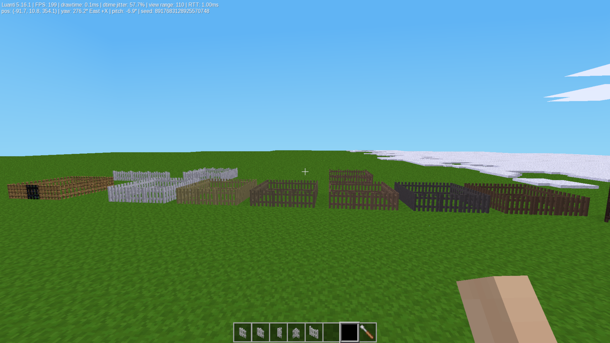
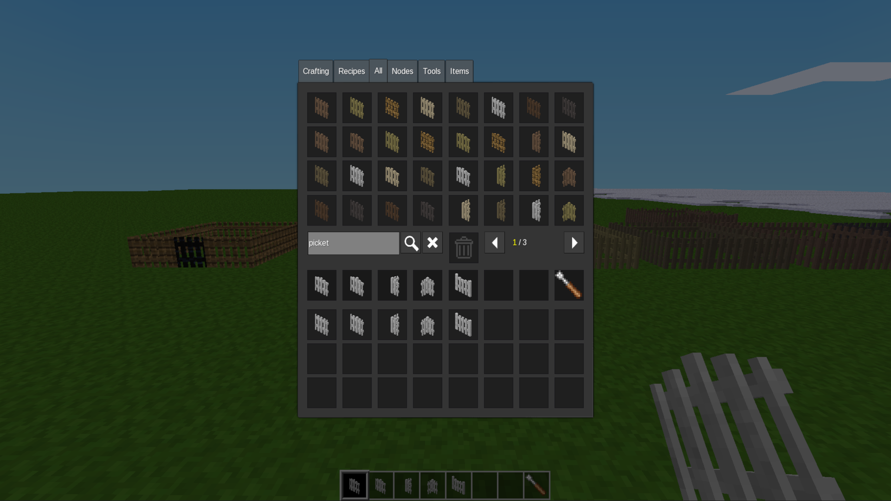
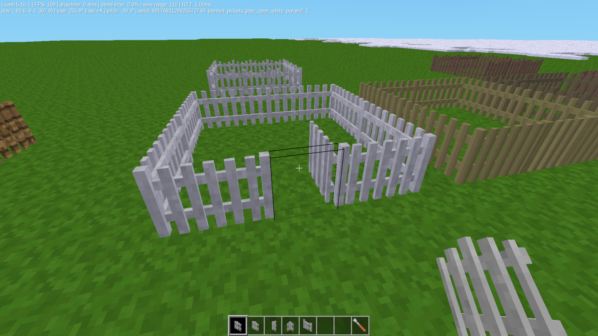
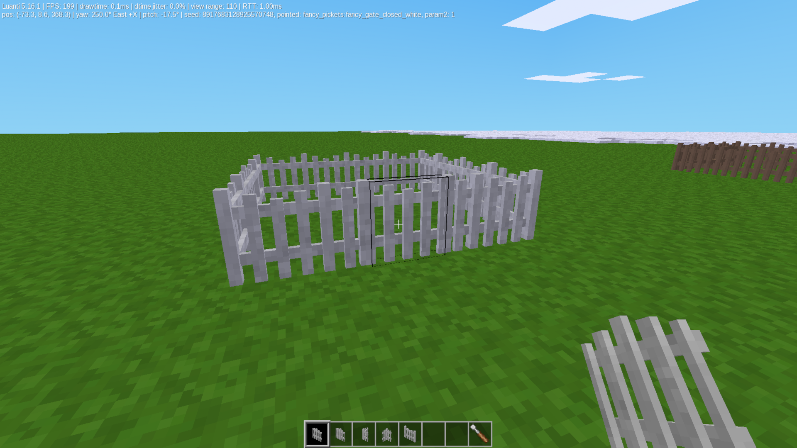
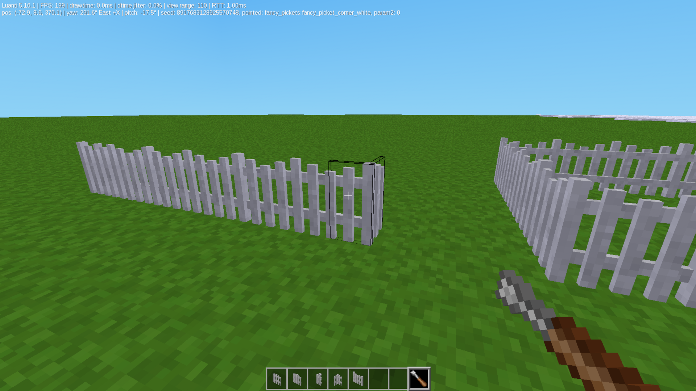
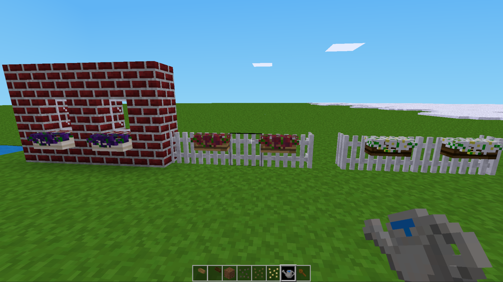

# Pickets

A mod for Minetest Game for the Luanti Engine (formerly Minetest) that adds picket fences, fancy decorative fences, and matching working gates, and nice flowerboxes to hang on your picket fence or under a window.

## Features
* **Picket Fences**: Classic wooden fencing options including straight paths, posts, inner corners, and outer corners.
* **Fancy Fences**: Decorative fencing variants for nicer builds.
* **Animated Gates**: Lightly animated gates.
* **Custom Textures**: Gates use two separate textures (one for the main panel and one for the post) so you can mix and match styles.
* **Custom Flowerboxes**: Nice flowerboxes you can hang on your picket fence or under a window, 10 wood varieties, and 3 flower varieties, but you can add more of each, and these have a setting to turn on / off as well.
* **Settings**: You can choose if you want to use both types of picket styles or just one, as well as each individual material, all set up to toggle each off or on in the settings tab of the Main Menu. [settings / Content: Mods / Pickets]

## Compatibility
* **Required Games**: Made specifically for `minetest_game`.
* **Dependencies**: Requires the `default` mod to be enabled.

## Tool Support
* Fully supports the **Screwdriver tool** for manually rotating fences and posts to face the exact direction you want.

## Installation
1. Download this mod folder.
2. Rename the folder to `pickets`.
3. Place it inside your Luanti/Minetest `mods` directory.
4. Enable the mod in your world settings before playing.

## Licenses
* **Code**: MIT License — Copyright (C) 2015-2026 TumeniNodes
* **Media (Textures, Models, Sounds)**: CC-BY-SA — Copyright (C) 2015-2026 TumeniNodes

### Screenshots

